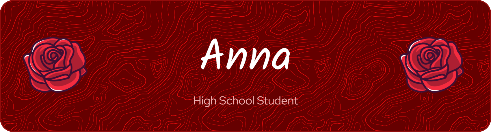

<h1 align="center" >❤️Welcome to Anna’s World (@AnnaBia22)❤️</h1>

  Book lover • Coder in red • Olympiads 

---

## 🍒 About Me

- 🌹I’m obsessed with **true crime**, **thriller books**, and **programming**🌹  
- 🐞Fight Krav Maga and dance Ballet (and some other dances)🐞  
- 🍓I love the hairless cat🍓
- 📍My favorite colour is red (I think is easy to find out)📍  
- 📕**she/her**📕
- ❗Capricorn❗
---

## ☎️ Get in Touch

---

## 🌶️ Tools & Languages

---

## 🍎 GitHub Stats

  
  

---

## 🩸 Featured Projects

| 💞Project💞 | 💋Description💋 |
|-----------|----------------|
  | Olympiads codes |
|  | Sistema de controle de estoque simples em C |
|  | Uma calculadora básica feita em C |
|  | Um site com visual fofo e feminino, feito em HTML |
---

## 🧲 Quote

> _"Code is like humor. When you have to explain it, it’s bad."_ — **Cory House**

---

  

  ❤️Thanks for visiting! Let’s build something magical together.❤️

  

